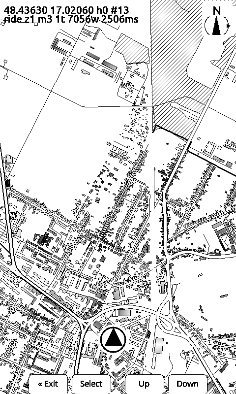
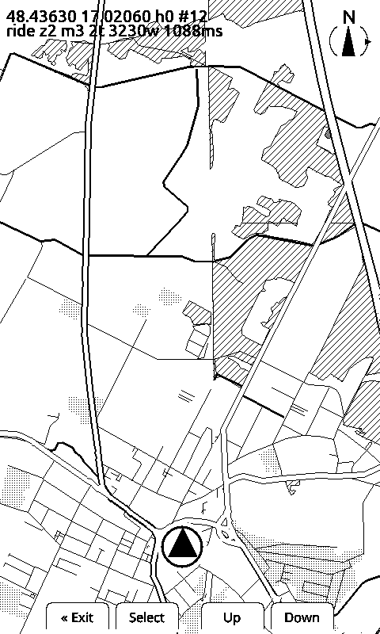
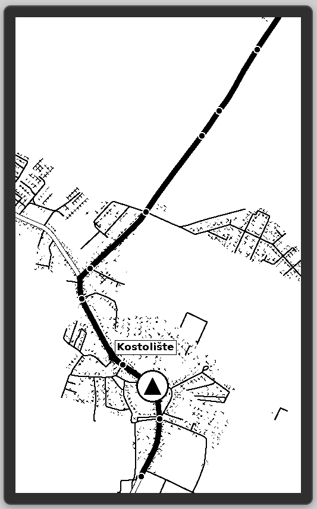
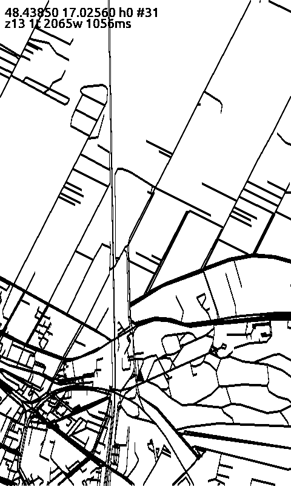

<p align="center">
  <picture>
    <source media="(prefers-color-scheme: dark)" srcset="./docs/images/explorink-lockup-dark.svg">
    
  </picture>
</p>

# ExplorInk

An outdoor trip companion for e-ink readers: offline maps and navigation for
motorcycle rides and hiking. A fork of
[CrossPoint Reader](https://github.com/crosspoint-reader/crosspoint-reader),
which is where nearly everything that makes this device work came from — see
[Credits](#credits).

Project site, with real panel screenshots and the development log:
**[explorink.com](https://explorink.com/)**.

> **Working prototype, active development. No packaged release yet.**
> It runs on real hardware: the map screen draws OSM data off the SD card, a
> phone drives it over BLE, the marker follows the fix without redrawing the
> map, and the renderer follows most of the map style on the panel — per-class
> road widths and casings, dithered or hatched buildings, forest, built-up and
> water areas, place names and a loaded route. Junction dots and off-screen
> place markers are the pieces still missing.
>
> Installing it today means a cable and PlatformIO: build and flash from source,
> as below. There is no one-click flasher and no store app yet. Formats and the
> BLE protocol change without notice. If you want a finished e-reader today, use
> [CrossPoint](https://github.com/crosspoint-reader/crosspoint-reader) — this
> fork trades its features away for a different purpose.

<p align="center">
  
  
</p>

<p align="center">
  <sub><b>The real panel, not a render.</b> Both frames are the device's own
  framebuffer, pulled over USB serial with <code>CMD:SCREENSHOT</code>. Malacky at
  3 m/px on the left and 6 m/px on the right, off SD-card tiles. Areas are
  dithered or hatched, never filled solid: a solid black building swallows the
  roads around it on a one-bit panel. Buildings are drawn individually up close
  and replaced by a built-up area further out — that switch happens when the
  tiles are built, so the device never reads what it would not draw. The debug
  line and the button hints are development furniture. Viewport reset measured on
  the device: 2506 ms at 3 m/px reading 484 KB, 1088 ms at 6 m/px reading
  198 KB.</sub>
</p>

<p align="center">
  
  
</p>

<p align="center">
  <sub><b>Left: where it is going.</b> The map tooling's own sketch of the render
  spec — place labels, a thick route with junction dots and the position puck,
  none of which the firmware draws yet. <b>Right: the same device eight days
  earlier</b>, before any of the style reached the renderer: every road one
  width, no areas at all. Kept as the before picture.</sub>
</p>

## Why a separate fork

A phone is a bad navigation display on a motorbike. The screen washes out in
direct sun, it overheats in a handlebar mount, and the battery does not last a
day of riding. E-ink has the opposite properties: readable in full sunlight,
free to hold an image on screen, and tens of hours of runtime because power is
only spent when the picture changes.

What it gives up is refresh rate and colour. Grey it does have -- four levels,
one extra waveform pass each (`docs/eink-grayscale.md`) -- but the refresh rate
is the binding constraint. That rules out the moving map a phone gives you and
forces a different design: a still image showing where you are, where the route
goes and what is around you, redrawn rarely and readable at a glance at speed. No rerouting, no voice, no live traffic — the route is
planned before you leave.

That is a different product from an e-reader rather than an extra feature on
one, and it falls outside CrossPoint's [scope](./SCOPE.md), so it is a fork and
not a pull request.

## Status

| | |
|---|---|
| Map activity and screen | exists |
| BLE position receiver (phone sends GPS) | exists |
| Loading a real map from the SD card | exists |
| Buttons on the map screen (zoom, marker height) | exists, per mode, saved across power cycles. Seven zoom rungs, 1 to 45 m/px — the top two are the regional view, added 2026-08-12. The marker, the move floor and the keep-in margin all scale with the rung. See [`docs/zoom-rungs.md`](./docs/zoom-rungs.md) |
| Command console (serial and BLE), zoom/mode filter | exists — same grammar over USB and BLE |
| Marker follows the fix without redrawing the map | exists, **verified on hardware 2026-08-05** by replaying a recorded ride — 117 fixes cost 31 skips, 71 windowed marker refreshes and 14 full redraws, ~160 s against the ~1,040 s all-redraws would have cost, heap flat. A fix moves the marker and refreshes one 64x64 rectangle; the map is redrawn only when the marker nears an edge, the rider turns 90°, or the ghosting budget runs out. See [`docs/map-follow.md`](./docs/map-follow.md) |
| Track-up map | exists — the fix's heading is up on screen and the north indicator rotates to match |
| Renderer following the map style spec | mostly — per-class road widths and casings, hidden classes, buildings, forest, built-up and water areas with dither tones or hatch, place dots and place names, the route line, marker anchor. Confirmed on the panel, not only in the preview. Junction dots and off-screen place markers: **not implemented**. See [`docs/place-labels.md`](./docs/place-labels.md) and [`docs/route-layer.md`](./docs/route-layer.md) |
| Four-level grey on the panel | exists, and the map deliberately does not use it — a dither pattern read better for area fills and survives a refresh. See [`docs/eink-grayscale.md`](./docs/eink-grayscale.md) |
| Screenshots over USB serial | exists — 1-bit framebuffer, plus a grey variant that re-renders both bit planes |
| Nearby: what useful things are around the rider | built 2026-08-21, **unverified on hardware** — drinking water, shelter, huts, lodging, fuel, medical, pharmacy, rescue, SOS phones, transport out, from the GPS fix over 25 km, with a POI mark layer per category and a destination readout in the header. See [`docs/nearby-menu.md`](./docs/nearby-menu.md) |
| Route following, off-route warning | **not started** |
| Companion phone app | exists — [ExplorInk GPS](https://github.com/rfordinal/explorink-android), an Android BLE position sender and ride recorder |

`data/mapstyle.json` holds the styling the renderer is meant to follow — road
widths and casings per class, building, forest, built-up and water area fills,
junction dots, place labels, the position marker. It is written by the mapbuilder
webapp rather than edited by hand. It is a
build-time input, not a runtime one: `scripts/gen_mode_masks.py` compiles its
`modes` block into the ride/hike/cycle class masks and `scripts/gen_mapstyle.py`
compiles the drawing numbers into a `MapStyle` constant, both as `pre:` build
steps; the device reads no style file at runtime. See
[`docs/map-style.md`](./docs/map-style.md).

The same renderer builds as a host binary — `pio run -t map-preview` renders real
tiles to a PPM with no ESP32 toolchain and no flashing, which is how a style
change gets checked in seconds.

The map tooling itself — OpenStreetMap fetch, projection, routing along real
roads, and a browser tuner with a pixel-exact 480x800 preview — lives in a
companion workspace that is not published, together with the render
specification this firmware is meant to implement.

## Inherited and new

Everything that makes an ESP32-C3 e-ink device work is CrossPoint's: the display
driver, the partial refresh path, the activity system, settings, i18n, the web
server and file manager, the build and test setup. This fork adds a map
activity, a BLE position server and the map style file, and over time strips out
the e-reader stack — EPUB, OPDS, dictionary, the font library — that a
navigation device does not need.

Upstream fixes therefore still matter here. The intent is to keep tracking
CrossPoint rather than drift away from it.

## Hardware

ESP32-C3 based Xteink [X4](https://www.xteink.com/products/xteink-x4) and
[X3](https://www.xteink.com/products/xteink-x3) — the same devices CrossPoint
supports. Development and testing happen on an X4.

## Development quick start

### Prerequisites

- [pioarduino](https://github.com/pioarduino/pioarduino) or VS Code + pioarduino plugin
- Python 3.8+
- `clang-format` 21
- USB-C cable supporting data transfer

### Setup

```bash
git clone --recursive https://github.com/rfordinal/explorink
cd explorink

# if cloned without --recursive:
git submodule update --init --recursive
```

### Nix/NixOS

Enter the development shell with either `nix develop` (flakes) or `nix-shell`:

```bash
nix develop -f nix
# or
nix-shell nix
```

To flash a connected ESP32-C3 device, enable PlatformIO's udev rules in your
NixOS configuration:

```nix
services.udev.packages = with pkgs; [ platformio-core.udev ];
```

After rebuilding the system configuration, reconnect the device or reload udev
rules.

### Build / flash / monitor

```bash
pio run --target upload
pio device monitor
```

That builds `[env:default]`, which is the only environment with the phone link in
it. **`gh_release` has no BLE**, so a binary built there has no GPS and no tile
transfer: [`docs/build-environments.md`](./docs/build-environments.md) has the
table, the flash offsets and what a published build must be.

### Pre-PR checks

```bash
./bin/clang-format-fix
pio check -e default
pio run -e default
```

### Native map preview

The map renderer and tile reader have no hardware dependency, so they build
and run on a laptop without the ESP toolchain. `map_preview` reads real
`.tib` tiles (mapbuilder/tilegen/build_tiles.py output) around a coordinate:

```bash
cmake -S test -B build/test -DCMAKE_BUILD_TYPE=Release
cmake --build build/test --target map_preview
./build/test/map_preview/map_preview \
  --tiles test/map_tile_reader/fixtures/tiny-sd \
  --lat 48.531158410819025 --lon 17.072751469276742 \
  --heading 0 --zoom 0 --out out.ppm
```

It writes a 480x800 one-bit image. Note that `PpmCanvas` rasterizes separately
from the real `GfxRenderer`, so the result is layout-accurate, not
pixel-accurate against the device.

## Documentation

The docs under [`docs/`](./docs) are inherited and still accurate for the parts
this fork has not touched — firmware internals, the activity manager, file
formats, i18n and the contributing guide all came from CrossPoint.

[`docs/optimization/`](./docs/optimization) is this fork's own: a full code
review of the map, BLE and tile paths (2026-08-06), one plan per area, with a
measurement gate for each. Start at its
[`README.md`](./docs/optimization/README.md).

[`docs/build-environments.md`](./docs/build-environments.md) is which of the five
build environments can be published and which two are missing Bluetooth, plus the
three flash offsets verified against a real device's own dump.

[`docs/ble-advertising.md`](./docs/ble-advertising.md) is what the device puts on
the air before a phone connects, and when: only while the map or sync-map-tiles
screen is open, so the advertisement is what the phone app wakes on.

[`docs/power-test-runbook.md`](./docs/power-test-runbook.md) is the procedure a
session follows to run the power experiments: order of work, exact config, the
pre-flash checklist, what to do when there is no microamp meter, and the outcome that
ends each line of work.

[`docs/power-idle-sleep.md`](./docs/power-idle-sleep.md) is the plan for parking
the device on the map screen -- what a parked state costs, what wakes it without
the rider touching it, and why deep sleep on a timer is not the answer. The
behaviour findings behind it are in
[`docs/power-management.md`](./docs/power-management.md); the measurement campaign
is [`docs/power-plan.md`](./docs/power-plan.md).

[`docs/map-memory.md`](./docs/map-memory.md) is what the map screen actually
costs in RAM, measured on hardware 2026-08-10: 75 KB of the 124 KB free heap, and
86 % of that in the BLE stack rather than in the map. Trimming the NimBLE config
to one peripheral connection gave 9 KB back and put the screen above its 50 KB
gate.

[`docs/virtual-device.md`](./docs/virtual-device.md) is how map and UI work gets
done with no device on the desk, in two layers. `test/map_window` **exists since
2026-08-22**: the real `MapFollow` decisions and the real `MapRenderer` in an
SDL2 window at 480x800, replaying a recorded ride at its own pace, with the
refresh counts and the real dirty rectangle alongside -- see
[`docs/map-follow.md`](./docs/map-follow.md), "`map_window`". VX4, running this
firmware unchanged on an emulated ESP32-C3, is **decided and not built**; the doc
carries the platform choice (Wokwi, not QEMU), the rule that VX4 must clone the
X4 exactly, the gate that no production code may change to suit the simulator,
and what neither layer will ever test.

[`docs/home-screen.md`](./docs/home-screen.md) is the Home screen: the brand
block's asset pipeline (two generator scripts, one traced SVG), the seven rows
and why three of them draw dimmed, and how a row is dimmed on a panel with no
grey. Verified on the X4 2026-08-21; input handling still untested.

[`docs/eink-refresh-degradation.md`](./docs/eink-refresh-degradation.md) is why
the panel refreshes badly in daylight. A refresh under a thumb came out white
everywhere except under the thumb, and a waveform is global -- so the cause acts
on the glass, not in the code: light raising the backplane's leakage while the
pixels are being driven. No firmware change fixes that; a hood and a second
refresh pass do. Two separate code defects sit underneath it -- the map cleans
the panel on its entry frame and never again (`Ssd1677Driver` has no ghost-clear
counter), and the one clean it has is deliberately under-driven. All of it
unmeasured: the X4 was lost on the ride that produced the second report.

## Credits

**This project exists because of
[CrossPoint Reader](https://github.com/crosspoint-reader/crosspoint-reader)** —
open-source e-reader firmware for Xteink devices, community-built and fully
hackable, MIT licensed, © 2025 Dave Allie and contributors. The e-ink driver,
refresh handling, UI framework and toolchain in this repository are their work,
not ours. ExplorInk replaces only what it must for a different purpose.

If CrossPoint is useful to you, support the people who maintain it:
[fund contributors](https://app.royalty.dev/crosspoint-reader/crosspoint-reader),
or buy an X3/X4 Developer Edition through
[crosspointreader.com](https://crosspointreader.com), which sends them a share
of each sale.

Built on [freeink-sdk](https://github.com/Free-Ink/freeink-sdk) by FreeInk, MIT
licensed, © 2026 FreeInk.

CrossPoint in turn credits
[diy-esp32-epub-reader](https://github.com/atomic14/diy-esp32-epub-reader) as
its inspiration.

Map data © [OpenStreetMap](https://www.openstreetmap.org/copyright)
contributors, ODbL.

## Licence

MIT, inherited from CrossPoint — see [LICENSE](./LICENSE).

---

ExplorInk is **not affiliated with Xteink, CrossPoint, or any device
manufacturer**.
